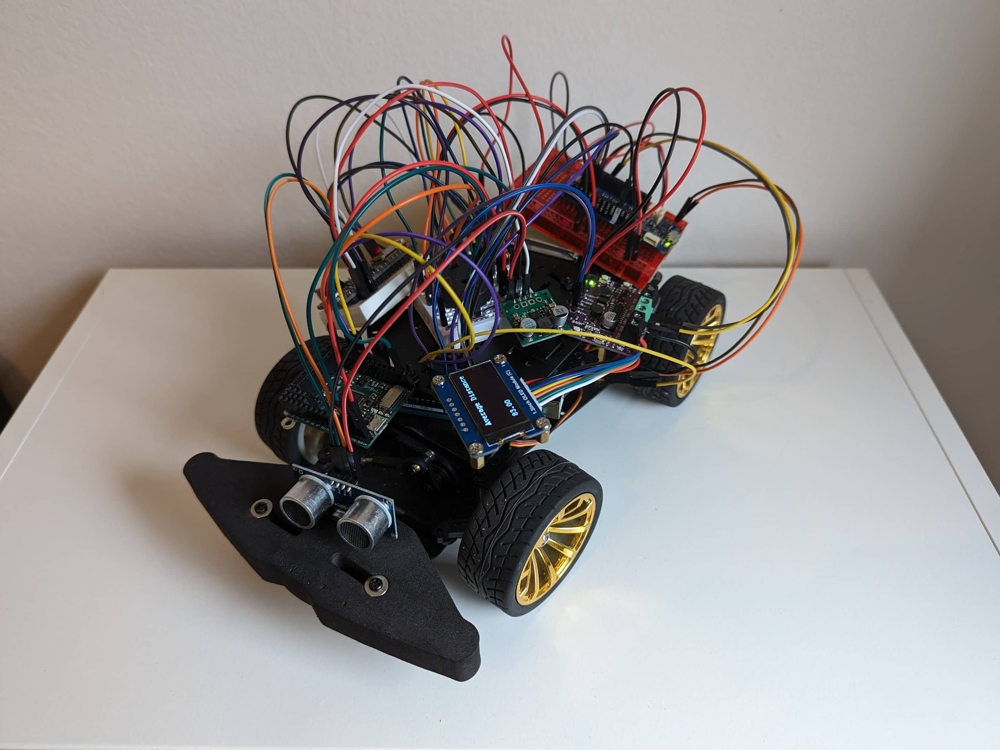

# IoT RC Car - The ByteBuggy

<!-- TABLE OF CONTENTS -->
## Table of Contents

- [IoT RC Car - The ByteBuggy](#iot-rc-car---the-bytebuggy)
  - [Table of Contents](#table-of-contents)
  - [About](#about)
  - [Setup](#setup)
  - [License](#license)
  - [Contact](#contact)
  - [Acknowledgements](#acknowledgements)

<!-- ABOUT THE PROJECT -->
## About

This project integrates various components to create a fully functional IoT RC car. It leverages the capabilities of the Arduino MKR WiFi 1010, Arduino Uno R3, MicroPython pyboard, Adafruit Feather 32u4, Maker Drive H-Bridge Motor Driver, and a servo motor. Through a standard web browser such as Chrome or Firefox, users can effortlessly control the car's movements.

Among its key features, the car is equipped with a distance sensor for accurate measurements, a custom "radio", and a screen to display real-time distance data. Moreover, it seamlessly connects to AWS, enabling data transmission to AWS IoT Central for monitoring and storing data in an S3 bucket for further analysis.

<!-- GETTING STARTED -->
## Setup

For additional information, a deeper dive into the project's details, and the challenges encountered during its development, refer to the article, *['Arduino IoT RC Car: 4 MCUs, Wi-Fi Control and AWS Integration.'](https://www.engineeracar.com/arduino-iot-rc-car/)*.

<!-- LICENSE -->
## License

Distributed under the MIT License. See `LICENSE` for more information.

<!-- CONTACT -->
## Contact

Halldor Stefansson - [@halldorstefans](https://twitter.com/halldorstefans) - halldor@engineeracar.com

<!-- ACKNOWLEDGEMENTS -->
## Acknowledgements

- [Waveshare - 1.3inch OLED Module (C)](https://www.waveshare.com/wiki/1.3inch_OLED_Module_(C))
- [Arduino Documentation - Securely Connecting an Arduino MKR WiFi 1010 to AWS IoT Core](https://docs.arduino.cc/tutorials/mkr-wifi-1010/securely-connecting-an-arduino-mkr-wifi-1010-to-aws-iot-core/)
- [Arduino Forum - Yet another Software Serial by Robin2](https://forum.arduino.cc/t/yet-another-software-serial/242865)
- [Reddit (r/embedded - user/UniWheel) - R/C Car project Help](https://www.reddit.com/r/embedded/comments/1aq1wp5/rc_car_project_help/)
